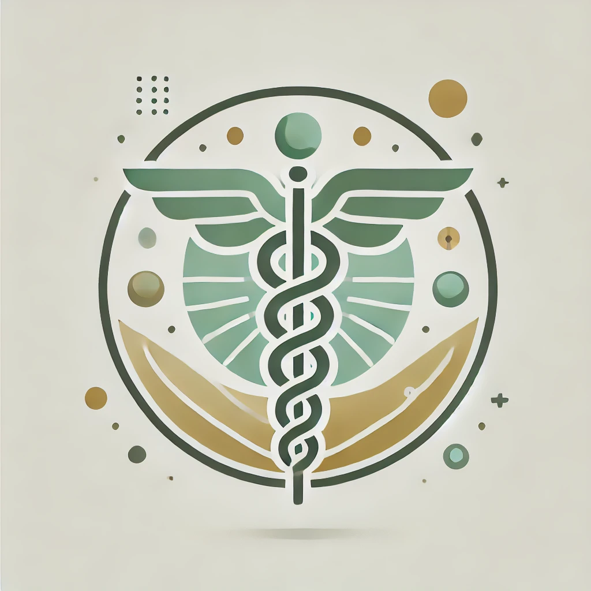

# Ophiuchus - Medical Chatbot


## Introduction
Ophiuchus is a cutting-edge medical chatbot that harnesses the power of advanced Natural Language Processing (NLP) and vector database technologies to deliver insightful, context-rich medical knowledge. Named after the ancient symbol of healing, the serpent-bearer constellation tied to Asclepius—the god of medicine—Ophiuchus represents the fusion of classical medical wisdom and modern AI intelligence.

Built using the Mistral model and Pinecone for semantic search, Ophiuchus is designed to assist medical professionals, students, and researchers in quickly accessing trusted information through an intuitive and intelligent conversational interface.


## Features
- **Advanced NLP Processing**: Uses the Mistral model to generate accurate medical responses.
- **Vector Database for Retrieval**: Pinecone ensures efficient storage and retrieval of medical information.
- **Reliable Knowledge Source**: Utilizes *The Gale Encyclopedia of Medicine* as the primary knowledge base.
- **User-Friendly Interface**: Streamlit-based UI for seamless interaction.
- **Secure API Access**: FastAPI-based backend for structured request handling.

## Tech Stack
- **Frontend**: Streamlit
- **Backend**: FastAPI
- **LLM**: Mistral
- **Vector Database**: Pinecone
- **Infrastructure**: GCP (Google Cloud Platform)
- **Dependency Management**: Poetry

## Workflow
1. **Data Ingestion**: Medical knowledge from *The Gale Encyclopedia of Medicine* is indexed in Pinecone.
2. **User Query Processing**: The chatbot receives user queries via the Streamlit interface.
3. **Retrieval & Generation**: The system fetches relevant context from Pinecone and utilizes Llama-2 for response generation.
4. **Response Delivery**: The generated response is returned to the user via the frontend.

## Installation
1. **Clone the Repository:**
   ```bash
   git clone [https://github.com/alkairis/Ophiuchus.git](https://github.com/alkairis/Ophiuchus.git)
   cd Ophiuchus
   ```
2. **Set Up Virtual Environment:**
   ```bash
   poetry install
   ```
3. **Run the Backend:**
   ```bash
   uvicorn app.main:app --host 0.0.0.0 --port 8000
   ```
4. **Run the Frontend:**
   ```bash
   streamlit run app/ui.py
   ```

## Future Enhancements
- Integration with additional medical knowledge sources.
- Support for voice-based queries.

## License
This project is licensed under the MIT License.

---
Feel free to contribute or raise issues via GitHub!
